# Azure User Onboarding Automation

[](https://opensource.org/licenses/MIT)
[](https://azure.microsoft.com/)
[](https://powerautomate.microsoft.com/)
[](https://GitHub.com/Naereen/StrapDown.js/graphs/commit-activity)

> An automated employee onboarding solution using Microsoft Azure, Power Automate, and Microsoft Forms to streamline user account creation and group assignment.

## ✨ Features

- 🚀 **Automated User Creation** - Automatically creates Azure AD user accounts from form submissions
- 🎯 **Dynamic Group Assignment** - Users are automatically added to security groups based on department
- 📝 **Form-Based Data Collection** - Standardized onboarding form for consistent data capture
- 🔒 **Security-First Approach** - Accounts created in disabled state requiring manual activation
- ⚡ **Zero-Code Solution** - Built entirely with Microsoft's low-code/no-code tools

## 📋 Prerequisites

Before you begin, ensure you have:

- [ ] **Microsoft Entra Premium P2** account
- [ ] **Microsoft 365 Business Basic** subscription  
- [ ] Administrative access to Azure Portal
- [ ] Power Automate access

> 💡 **Tip**: Free trials are available for both services if you want to test the solution first.

## 🏗️ Architecture

### System Overview

```mermaid
flowchart TD
    A[👤 New Employee] --> B[📝 Microsoft FormsOnboarding Form]
    B --> C[⚡ Power AutomateTrigger: Form Submitted]
    C --> D[📋 Get Form ResponseExtract Employee Data]
    D --> E[👥 Create User AccountAzure AD/Entra ID]
    E --> F[🔒 Account CreatedStatus: Disabled]
    F --> G[🏷️ Auto-assign to GroupBased on Department]
    G --> H[✅ Onboarding CompleteReady for Manual Activation]
    
    style A fill:#1976d2,stroke:#0d47a1,stroke-width:2px,color:#fff
    style B fill:#7b1fa2,stroke:#4a148c,stroke-width:2px,color:#fff
    style C fill:#388e3c,stroke:#1b5e20,stroke-width:2px,color:#fff
    style D fill:#f57c00,stroke:#e65100,stroke-width:2px,color:#fff
    style E fill:#c2185b,stroke:#880e4f,stroke-width:2px,color:#fff
    style F fill:#d32f2f,stroke:#b71c1c,stroke-width:2px,color:#fff
    style G fill:#00796b,stroke:#004d40,stroke-width:2px,color:#fff
    style H fill:#689f38,stroke:#33691e,stroke-width:2px,color:#fff
```



**Workflow:**
1. Employee fills out onboarding form
2. Power Automate triggers on form submission  
3. User account is created in Azure AD
4. User is automatically assigned to appropriate security group

## 🚀 Quick Start

### Step 1: Create Security Group

Navigate to **Azure Portal** → **Groups** → **New Group**

```yaml
Group Configuration:
  Type: Security
  Name: "help desk"
  Description: "help desk"
  Azure AD Roles Assignment: No
  Membership Type: Dynamic User
  
Dynamic Query:
  Property: Department
  Operator: Equals
  Value: "help desk"
```


### Step 2: Create Microsoft Form

Open **Microsoft Forms** and create: **"Employee Onboarding Form"**

**Required Fields:**
- ✅ First Name (Text)
- ✅ Last Name (Text)  
- ✅ Start Date (Date)
- ✅ Email Address (Text)
- ✅ Department (Choice)
- ✅ Form Rating (Rating)


> Make all questions mandatory before saving

### Step 3: Configure Power Automate Flow

1. Open **Microsoft Power Automate** → **Create** → **Automated cloud flow**
2. Name: `Employee Onboarding Automation`

**Flow Configuration:**

```yaml
Trigger:
  Connector: Microsoft Forms
  Event: "When a new response is submitted"
  Form: "Employee Onboarding Form"

Action 1 - Get Response:
  Type: Microsoft Forms - Get Response Details
  Form ID: [Your Form]
  Response ID: [Dynamic Value]

Action 2 - Create User:
  Type: Microsoft Entra ID - Create User
  Settings:
    Account Enabled: No
    Display Name: [First Name] + [Last Name]
    Mail Nickname: [First Name]
    Password: Default (change required)
    User Principal Name: [Email Address]
    Department: [Form Response]
```


## 🧪 Testing

1. Fill out the onboarding form with test data
2. Select "help desk" as department
3. Submit the form
4. Verify user creation in Azure AD
5. Confirm group assignment
6. Check account is disabled by default

## 📊 Monitoring

| Component | What to Monitor |
|-----------|----------------|
| **Power Automate** | Flow run history and success rates |
| **Azure AD** | User creation logs and audit trail |
| **Security Groups** | Dynamic membership updates |

## 🛡️ Security Features

- 🔐 **Disabled by Default** - All accounts created in disabled state
- 🔑 **Password Policy** - Force password change on first login
- 👤 **Manual Activation** - IT must manually enable accounts
- 📋 **Audit Trail** - All actions logged in Azure AD

## 🔧 Troubleshooting

<details>
<summary>Common Issues & Solutions</summary>

| ❌ Issue | ✅ Solution |
|----------|-------------|
| Flow fails to trigger | Verify connector permissions and form selection |
| User creation fails | Check Azure AD permissions for service account |
| Group assignment doesn't work | Validate dynamic group query syntax |
| Form not found | Ensure form sharing permissions are correct |

**Debug Steps:**
1. Check all required permissions are granted
2. Verify connector authentications are valid  
3. Review Power Automate run history for errors
4. Test each component individually

</details>

## 🚀 Enhancements

Ready to scale? Consider these improvements:

- 🏢 **Multi-Department Support** - Handle multiple departments and security groups
- 📧 **Email Notifications** - Welcome emails with onboarding instructions  
- ✅ **Approval Workflows** - Manager approval before account creation
- 📄 **License Assignment** - Automatic Microsoft 365 license assignment
- 🔗 **HR Integration** - Connect with existing HR systems

## 📈 Enterprise Scaling

For larger organizations:

```yaml
Scaling Considerations:
  - Department-specific forms and flows
  - Role-based security group assignments  
  - Conditional logic for different user types
  - Azure Logic Apps for complex scenarios
  - Integration with existing IAM systems
```

## 📖 Project Summary

This Azure User Onboarding Automation solution streamlines the employee onboarding process by eliminating manual account creation tasks. When a new employee fills out the Microsoft Form, the system automatically:

- **Creates** a disabled Azure AD user account with all provided details
- **Assigns** the user to the appropriate security group based on their department
- **Enforces** security best practices with disabled accounts requiring manual activation
- **Maintains** an audit trail of all onboarding activities

The solution leverages Microsoft's native tools (Forms, Power Automate, Azure AD) to create a seamless, zero-code automation that reduces IT workload while maintaining security standards. Perfect for organizations looking to modernize their employee onboarding workflow without complex custom development.


---

<div align="center">


[🔝 Back to top](#azure-user-onboarding-automation)

</div>
